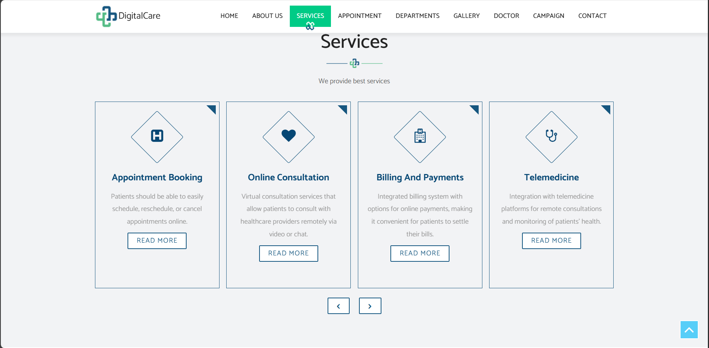
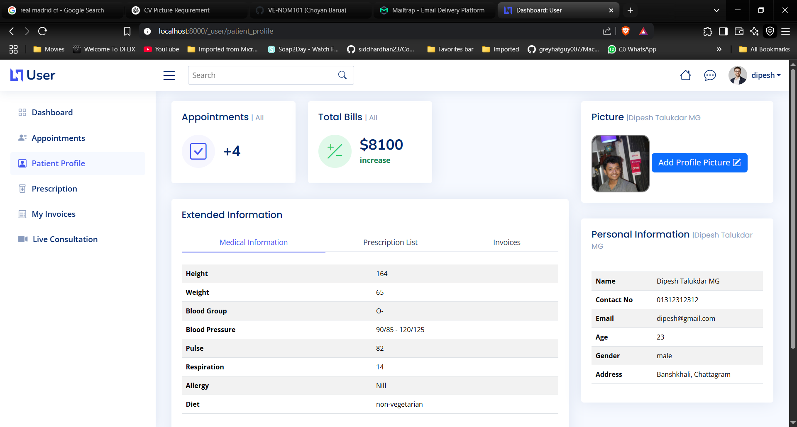
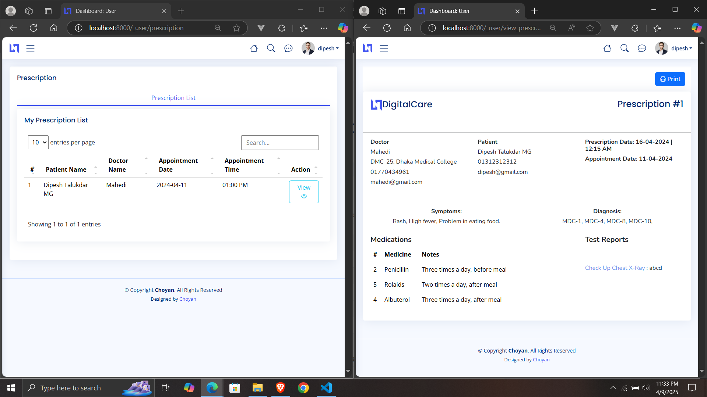
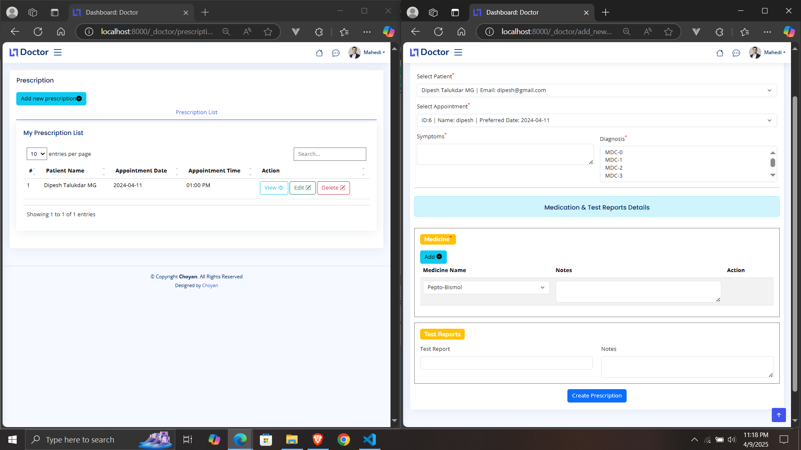

Here's a more detailed version of the **README.md** for **Digital Care**:

---

# **Digital Care**

**Digital Care** is a comprehensive web-based healthcare management system developed using **Laravel** and **MySQL**. This platform provides a multi-role login system for **doctors**, **patients**, **pharmacists**, **nurses**, and **admins**, each with their own personalized dashboards and a user-friendly, responsive landing page.
<h1>   A video is given: ./public/digitalcare_tut/digiralcare.mp4
</h1>

## Features
### **Landing Page:**

### **Login-Registration:**

### **Admin Dashboard:**
- **User Management:** Admins can manage users (doctors, patients, pharmacists, nurses) and their roles.
- **Appointment Management:** Admins can confirm appointments, view and manage appointment history.
- **Department and Bed Management:** Manage doctor departments and handle inpatient (IPD) patients with dynamic bed management.
- **Invoice Management:** Admins can view, update, and manage patient invoices.
- **Online Campaigns:** Manage and run online health campaigns to reach a broader audience.

### **Patient Dashboard:**
- **Appointment Booking:** Patients can book appointments with doctors and view their appointment status.
- **Payment Integration:** Pay for appointments and medical services using **SSLCommerz**.
- **Live Video Consultations:** Join live video consultations with doctors via **Jitsi** (video call API).
- **Prescription Management:** Download prescriptions with suggested medicines for easier treatment.

### **Doctor Dashboard:**
- **Schedule Management:** Doctors can set their availability and manage appointments.
- **Prescription and Invoice Generation:** Doctors can generate prescriptions for patients and handle invoice creation.

>

### **Pharmacist Dashboard:**
- **Medicine Management:** Pharmacists can manage medicine inventory and details for better pharmacy management.

### **Nurse Dashboard:**
-- **Edit Profile:**

### **Emergency Support:**
- **Ambulance Calling:** Integrated ambulance calling system via **SMS**, with addresses dynamically generated from the **map** for quick emergency response.

## Technologies Used:
- **Frontend:** HTML, CSS, Bootstrap, Vue.js
- **Backend:** Laravel, PHP
- **Database:** MySQL
- **APIs:** 
  - **Jitsi:** For live video consultations.
  - **Alpha SMS:** For ambulance calling system and notifications.
- **Payment Gateway:** SSLCommerz for secure payments.

## Tools and Technologies:
- **Laravel** for backend development.
- **Vue.js** for building dynamic user interfaces.
- **MySQL** for data storage and management.
- **Bootstrap** for responsive, mobile-first design.
- **Jitsi** for video call integration.
- **Alpha SMS** for emergency alerts and notifications.

---

Let me know if you need any further changes or additions!
